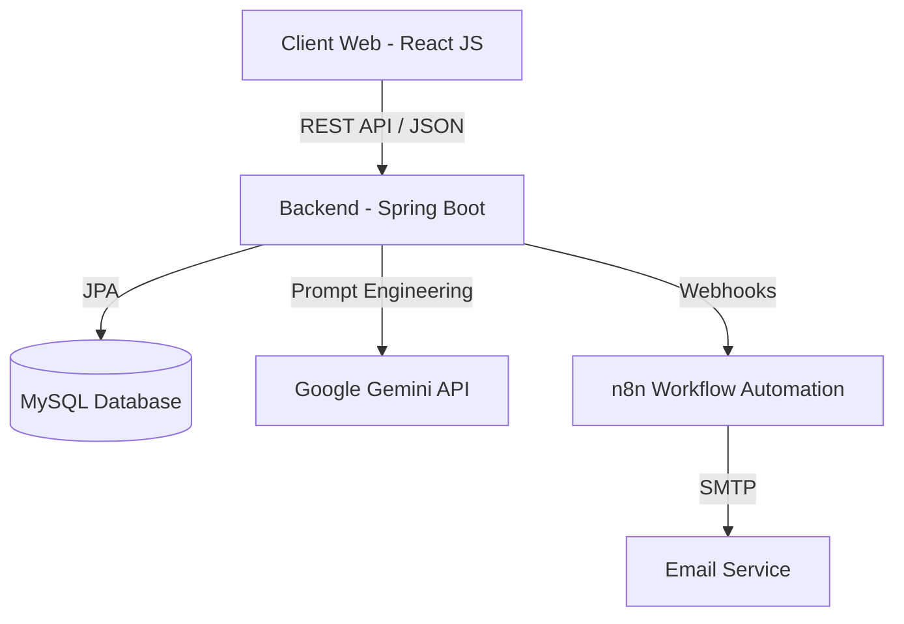

# 🚀 SmartHire : Le Recrutement 4.0 Propulsé par l'IA


> **L'IA ne remplace pas l'humain, elle l'augmente.** > SmartHire est une plateforme Full-Stack innovante qui automatise la pré-qualification des candidats grâce à l'Intelligence Artificielle Générative (Google Gemini), permettant aux recruteurs de se concentrer sur l'essentiel : les talents.

---

## 📑 Table des Matières

* [🌟 À Propos](https://www.google.com/search?q=%23-%C3%A0-propos)
* [✨ Fonctionnalités Clés](https://www.google.com/search?q=%23-fonctionnalit%C3%A9s-cl%C3%A9s)
* [🏗️ Architecture Technique](https://www.google.com/search?q=%23%EF%B8%8F-architecture-technique)
* [🛠️ Stack Technologique](https://www.google.com/search?q=%23%EF%B8%8F-stack-technologique)
* [🚀 Installation et Démarrage](https://www.google.com/search?q=%23-installation-et-d%C3%A9marrage)
* [📸 Aperçu de l'Application](https://www.google.com/search?q=%23-aper%C3%A7u-de-lapplication)
* [👤 Auteur](https://www.google.com/search?q=%23-auteur)

---

## 🌟 À Propos

Dans un contexte où les recruteurs sont noyés sous les candidatures, **SmartHire** résout le problème du tri manuel chronophage.

Ce projet, réalisé dans le cadre du cursus ingénieur à l'**ENSA Oujda** (Filière ITIRC), propose une solution complète :

1. **Analyse Sémantique :** Lecture et compréhension des CVs (PDF) par l'IA.
2. **Scoring Intelligent :** Comparaison contextuelle entre le CV et l'offre d'emploi.
3. **Automatisation :** Workflows d'e-mails et de notifications via n8n.

---

## ✨ Fonctionnalités Clés

### 👔 Pour les Recruteurs (RH)

* **Tableau de Bord Analytique :** Vue d'ensemble des offres et statistiques de recrutement.
* **Gestion des Offres (CRUD) :** Création d'offres avec formulaires personnalisés.
* **IA & Scoring Automatique :**
* Extraction automatique des compétences depuis les CVs PDF.
* Attribution d'un **Score de Compatibilité (0-100%)**.
* Justification textuelle générée par l'IA ("Pourquoi ce candidat matche ?").


* **Workflow Automatisé :** Invitation automatique des candidats sélectionnés via e-mail.

### 🧑‍💻 Pour les Candidats

* **Espace Candidat :** Création de profil et upload de CV.
* **Postulation Simplifiée :** Recherche multicritère et candidature en un clic.
* **Suivi en Temps Réel :** Statut des candidatures (En attente, Analysé, Accepté, Refusé).

---

## 🏗️ Architecture Technique

Le projet repose sur une architecture **Microservices-ready** séparant le Frontend, le Backend et les services tiers.



---

## 🛠️ Stack Technologique

### 🔙 Backend (`/backend_smart_hire`)

* **Framework :** Spring Boot 3.4.1 (Java 17)
* **Sécurité :** Spring Security, JWT (Stateless Authentication)
* **IA & Data :** LangChain4j (Intégration Gemini), Apache PDFBox (Parsing PDF)
* **Base de Données :** MySQL 8, Spring Data JPA
* **Doc API :** SpringDoc OpenAPI (Swagger UI)

### FrontEnd (`/frontend_smart_hire`)

* **Framework :** React 19
* **Style :** React Bootstrap, CSS3, Responsive Design
* **HTTP Client :** Axios
* **Routing :** React Router Dom 7

### ⚙️ DevOps & Outils

* **Automatisation :** n8n (Orchestration des envois d'emails)
* **Conteneurisation :** Docker (Dockerfile inclus)
* **Versionning :** Git & GitHub

---

## 🚀 Installation et Démarrage

### Prérequis

* Java JDK 17+
* Node.js & npm
* MySQL Server
* Clé API Google Gemini (AI Studio)

### 1️⃣ Configuration Backend

```bash
cd backend_smart_hire
# Ouvrez src/main/resources/application.properties
# Configurez votre base de données et votre clé API Gemini :
# spring.datasource.username=votre_user
# spring.datasource.password=votre_mdp
# langchain4j.google-ai-gemini.chat-model.api-key=VOTRE_CLE_API_GEMINI

# Lancer l'application
./mvnw spring-boot:run

```

> Le serveur démarrera sur `http://localhost:8080`. Documentation Swagger accessible sur `/swagger-ui.html`.

### 2️⃣ Configuration Frontend

```bash
cd frontend_smart_hire
# Installer les dépendances
npm install

# Démarrer le serveur de développement
npm start

```

> L'application sera accessible sur `http://localhost:3000`.

### 3️⃣ Configuration n8n (Optionnel)

Pour activer les notifications par email, installez n8n et importez le workflow JSON fourni dans le dossier `docs/n8n_workflow.json` (à créer si besoin). Configurez les webhooks pour écouter sur le port configuré dans `application.properties`.

---

## 📸 Aperçu de l'Application

| Landing Page | Tableau de Bord RH |
| --- | --- |
|  |  |
| *Accueil moderne et attractif* | *Statistiques et graphiques* |

| Analyse IA | Détail Candidature |
| --- | --- |
|  |  |
| *Liste des candidats avec Score IA* | *Justification générée par Gemini* |


---

## 👤 Auteur

**Abdellah AAZDAG**

* 🎓 Élève Ingénieur en ITIRC à l'**ENSA Oujda**
* 💼 Full-Stack, Data & IA Enthusiast
* 📧 [Email](aazdag.abdellah@gmail.com) - [LinkedIn](https://www.google.com/search?q=https://linkedin.com/in/aazdag-abdellah)

---
